 

## Sobre mim

Sou estudante de **Análise e Desenvolvimento de Sistemas (ADS)** e estou construindo minha base em programação. Hoje, meu foco está em **desenvolvimento web** e **dados**.

Venho do **Design**, e isso muda a forma como olho para uma interface: gosto de organização visual, de clareza e de resolver problemas com criatividade.

Atualmente, estou aberta a oportunidades de estágio e posições júnior em Tecnologia.

 

## O que estou estudando

<table>
  <tr>
    <td width="33%" valign="top">
      <strong>Web</strong>  
        
      HTML5 • CSS3 • JavaScript 
      Lógica de Programação
    </td>
    <td width="33%" valign="top">
      <strong>Dados</strong>  
        
      SQL • Python • MySQL
    </td>
    <td width="33%" valign="top">
      <strong>Ferramentas</strong>  
        
      Git • GitHub 
      Visual Studio Code • PyCharm
    </td>
  </tr>
</table>

 

## Design + Tecnologia

Meu background em Design complementa a minha formação técnica. Ele me ajuda a desenvolver:

- **Pensamento visual**, para enxergar a estrutura de uma tela;
- **Sensibilidade para interfaces** e para a experiência de quem as usa;
- **Organização** e **atenção aos detalhes**;
- **Criatividade** na construção de soluções.

Estou levando essa bagagem para a Tecnologia, sem deixar de estudar a base técnica.

 

## Projetos

Estou construindo projetos enquanto avanço nos estudos de programação.

| Projeto | Descrição | Tecnologias | Links |
| :-- | :-- | :-- | :-- |
| **maria-em-codigo-blog** | Blog pessoal em construção, onde estou consolidando meus conhecimentos em HTML e CSS. JavaScript entra em breve. | HTML5 • CSS3 | [Repositório](https://github.com/MariaHGMoraes/maria-em-codigo-blog) |

<!--
Modelo para o próximo projeto: copie uma nova linha na tabela acima.

| **Nome do projeto** | Descrição em uma linha | Tecnologias utilizadas | [Repositório](URL_DO_REPOSITORIO) · [Demo](URL_DA_DEMO) |
-->

 

## GitHub Stats

<table>
  <tr>
    <td>
      
    </td>
    <td>
      
    </td>
  </tr>
</table>

 

## Contato

  

