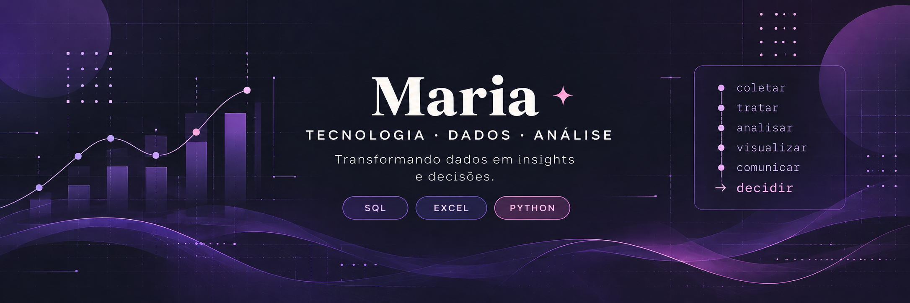

  

## 👋 Sobre mim

Sou profissional em transição para a área de Tecnologia, com foco em Dados. Venho construindo minha base em Análise de Dados e desenvolvendo conhecimentos em SQL, Excel, Python e ferramentas de visualização de dados.

Minha trajetória em Design e Tecnologia me trouxe uma combinação que considero um diferencial: olhar analítico, organização visual, atenção aos detalhes e facilidade para transformar informações complexas em algo claro e compreensível.

Atualmente, direciono meus estudos para análise, tratamento e interpretação de dados, buscando transformar informações em insights que apoiem decisões e gerem valor para o negócio.

## 📚 O que estou estudando

**Análise de Dados**
- SQL
- Excel
- Python
- Tratamento e análise de dados
- Visualização de dados

**Fundamentos**
- Lógica de programação
- Git & GitHub

**Na prática**
- Exercícios e estudos aplicados
- Construção do meu portfólio em Dados

## 🛠️ Tecnologias e ferramentas

### 📊 Dados & Análise

  
  
  
  

### 💻 Desenvolvimento

  
  
  

### 🔧 Ferramentas

  
  
  
  

## 🎨 Design + Dados

Minha trajetória em Design influencia a forma como trabalho com tecnologia e dados.

Tenho um olhar atento para organização visual, detalhes e comunicação, e gosto de transformar informações em algo mais claro e fácil de entender.

Acredito que essa combinação entre análise e comunicação visual pode ser um diferencial na forma de apresentar dados e contar histórias através deles.
